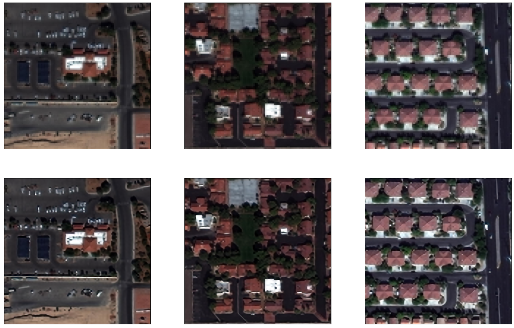

# Sattelite Image Super-Resolution using Convolution Neural Networks and Auto-encoders

In this project we will attempt to make an autoencoder network that can super resolve a satellite image to improve predictive performce on image sementation and classification tasks. 

## Predictive Performace: 
The currect methodology gives us a prediction accuracy of ~0.92% which is a promising result and a good basline (given that it was only 100 epochs). The images below illustrate images with their "super resolved" counterparts. 

